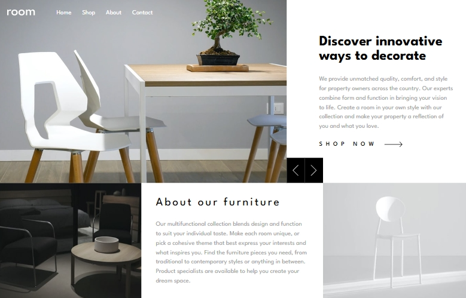

# Frontend Mentor - Room homepage solution

This is a solution to the [Room homepage challenge on Frontend Mentor](https://www.frontendmentor.io/challenges/room-homepage-BtdBY_ENq). Frontend Mentor challenges help you improve your coding skills by building realistic projects. 

## Table of contents

- [Overview](#overview)
  - [The challenge](#the-challenge)
  - [Screenshot](#screenshot)
  - [Links](#links)
- [My process](#my-process)
  - [Built with](#built-with)
  - [What I learned](#what-i-learned)
- [Author](#author)


## Overview

### The challenge

Users should be able to:

- View the optimal layout for the site depending on their device's screen size
- See hover states for all interactive elements on the page
- Navigate the slider using either their mouse/trackpad or keyboard

### Screenshot




### Links

- Solution URL: [Add solution URL here](https://github.com/dimitrisdr/room-homepage.git)
- Live Site URL: [Add live site URL here](https://dimitrisdr.github.io/room-homepage/)

## My process

### Built with

- Semantic HTML5 markup
- CSS custom properties
- Flexbox
- CSS Grid
- Mobile-first workflow


### What I learned

```html
  <picture class="header__img-container img-container">
    <source srcset="images/desktop-image-hero-1.jpg" media="(min-width:375px)">
    
  </picture>
```
```css
@media screen and (min-width:801px) {

    .header__head {
        justify-content: unset;
        flex-direction: row;
        gap: 3rem;
    }


    .description-section, .about-section {
        place-content: center;
    }

    .menu-btn-container {
        display: none;
    }

    .wraper {
        grid-template-areas: 'header header' 'img-d descr' 'about img-l';
    }

}


@media screen and (min-width: 1050px) {

    .header, .move-btns ,.description-section, .about-section, .img-dark, .img-light {
        grid-area: unset;
    } 
    
    .wraper {
        grid-template-areas: none;
        grid-template-columns: 8fr 8fr 1fr 1fr 8fr;
    }

    .header {
        grid-column: 1 / 3;
        grid-row: 1;
    }

    .move-btns {
        grid-column: 3 / 5;
        grid-row: 1;
        justify-self: stretch;
        max-width: 100%;
    }

    
    .move-btn {
        min-width: unset;
    }

    .description-section {
        grid-column: 4 / 6;
        grid-row: 1;
    }

    .img-dark {
        grid-column: 1 / 2;
        grid-row: 2;
    }

    .about-section {
        grid-column: 2 / 5;
        grid-row: 2;
    }

    .img-light {
        grid-column: 5 / 6;
        grid-row: 2;
    }
} 
```
```js
let animationInProgress = false; 

function animateEl(imgEl, dur = animationDur) {
    animationInProgress = true
    imgEl.style.animation = `showImage ${dur}s ease-in`
    setTimeout(()=> {
        imgEl.style.animation = ``
        animationInProgress = false
    }, dur*1000)
}

function changeText(el, dataForEl, curInd) {
    el.innerText = dataForEl[curInd]
    animateEl(el)
}
```

## Author

- Frontend Mentor - [@dimitrisdr](https://www.frontendmentor.io/profile/dimitrisdr)